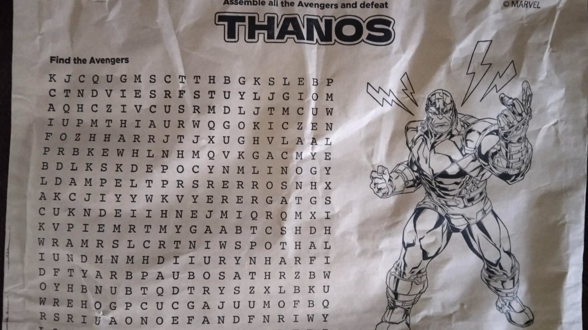
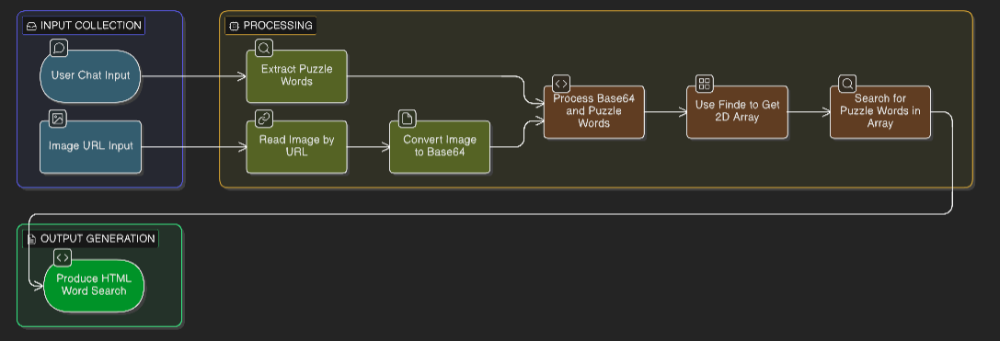

## Avengers Word Search Puzzle System 
# Word Search - User-System Interaction Document

## 1. Goal
The Avengers Word Search Puzzle System allows users to find hidden character names in a letter grid results with highlighted words. Using below attached image. Using Datastax langflow



---

## 2. Word Search Solver – Architecture with Flow
#### Step 1 – User Inputs
    - Words to search (e.g., Find words IRONMAN, THOR, HULK)

#### Step 2 – Prompt to produce output
    - Get user input (e.g., Find words IRONMAN, THOR, HULK)
    - Result words in specific format (e.g., IRONMAN, THOR, HULK)

#### Step 3 – Image Processing
    - Fetch image from URL
    - Convert image → Base64 string 

#### Step 4 – LLM Processing

    - Read Base64 string 
    - Result with 2D letter Grid JSON
    
#### Step 5 – Word finder
    - Detect letter grid
    - Search words (horizontal, vertical, diagonal)
    - Generate structured HTML output

#### Step 6 – Visualization

    - Grid with highlighted letters
    - Found / Not Found words list
    - color coding per word

## 3. Flow Diagram



---

# Word Search - Agent Specification Document
## Agents - LangFlow Components
1) Chat Input
2) Groq - Prompt to get Finding words in required format
3) Image base 64 Converter from URl (Custom Component)
4) Groq Vision - Read base64 string and Retrun 2D Letter grid Json (Custom Component)
5) Word Grid Finder - Inputs 2d letter grid  and prompt produced words. (Custom Component)
6) Chat output - HTML with Word highlight.

## LangFlow Diagram


| Connection | Data Type | Description |
|------------|-----------|-------------|
| Chat Input → Agent | Text | User input prompt |
| Groq Prompt → Agent | Text | Prompt to produce word in required format |
| Base64 Conversion → Agent | Image Url | Convert image into base64 string |
| Groq Vision → Agent | Base64 String(text) | Extracted Base64 string |
| Grid Parser → Word Solver | Data (structured) | 2D grid array + word list |
| Word Solver → Chat Output | Message (text/HTML) | HTML results with word highlighting |

---

### Environment Variables
```
GROQ_API_KEY=<your-groq-api-key>
```

## Input


## Output: 

